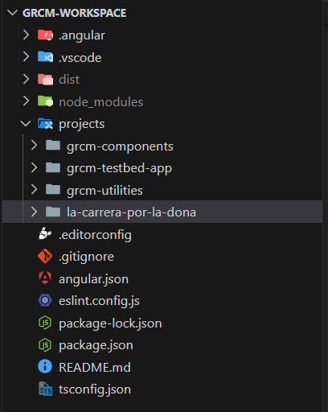
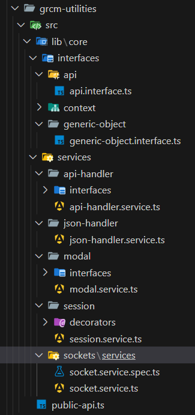
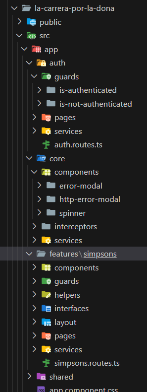

# 🍩 ¡La carrera por la dona!

Juego de mesa multijugador online inspirado en Los Simpsons, hecho con Angular, Socket.IO y json-server. 
Compite en un tablero lleno de desafíos estilo party game, ¡y sé el primero en alcanzar la dona!

---

## 🚀 Demo en vivo

👉 [¡Probar el juego!](https://guillercm.github.io/la-carrera-por-la-dona/)

---

## Información técnica del workspace

- Este juego está dentro de un workspace, en el que dentro tiene 4 proyectos:

     
    - **grcm-components**: Mi librería para crear formularios dinámicos, que está publicado en npm. [Ver aquí](https://www.npmjs.com/package/grcm-components). Uso mi propia librería para todos los formularios del juego.
    - **grcm-testbed-app**: No tiene nada especial, solo lo utilizo para hacer pruebas.  
    - **grcm-utilities**: Servicios, interfaces y componentes que en un pasado estuve haciendo en mi aplicación 'Angular'. [Ver repositorio](https://github.com/guillercm/angular). 
    También uso esta librería en mi juego, aunque a diferencia de la otra librería, esta es privada, solo con cosas mías.
      
    - **la-carrera-por-la-dona**: El proyecto del juego.  

---

## Información técnica del juego

- **La carrera por la dona**:  
    
    - **Auth**: Contiene la lógica de autenticación, basada en un sistema simple de nickname guardado en localStorage. Si hay nickname, el usuario entra directo al juego; si no, se redirige al login.
    - **Core**: Utilidades que uso en todo el juego, interceptores, el spinner global de carga de la app,etc.
    - **Simpsons**: La carpeta principal donde se desarrolla el juego.
    - **Shared**: En su mayoría, componentes de UI genéricos que utilizo en el juego.

---

## 🛠️ Stack Tecnológico

- **Frontend**: Angular 19 (Signals y RxJS)
- **Backend**: Node.js con json-server y Socket.io
- **Estilos**: SCSS, CSS y Bootstrap

---

## 👥 Jugadores

- De 4 a 8 jugadores

---

## 🧪 Tipos de Pruebas (De momento sólo está echa esta)

1. **Letra Secreta**: En Letra Secreta, los jugadores deben adivinar una palabra oculta. Cada segundo, se mostrará una letra aleatoria de la palabra durante 1 segundo, luego se ocultará, y aparecerá otra letra diferente de la palabra, repitiendo este ciclo. Los jugadores deben escribir rápidamente la palabra completa antes de que el tiempo se agote. La clave está en recordar las letras que aparecen brevemente y adivinar la palabra correcta antes que los demás. ¡La rapidez y la memoria son esenciales!

Las palabras del juego son: 
- El Bus Escolar de Otto.
- La Planta Nuclear de Springfield.
- El bar de Moe.
- El árbol de Navidad de los Simpsons.
- La carrera de Kart de Homer.
- El monorriel de Springfield.
- La tienda de Lard Lad.
- La Banca de Apu.
- El frigorífico de los Simpsons.
- Las donas de Homero.
- Troy McClure.
---

## 🎲 Dinámica de Ronda

1. **Tirada de dado** (1-6): Avanzas en el tablero.
2. **Volver a tirar dado**: Si en el anterior paso caíste en una casilla de dado, vuelves a tirar.
2. **Prueba**: Se abrirá una modal en el donde los jugadores harán una prueba (son las pruebas definidas arriba).

---

# 💡 Ideas Futuras

## De momento tengo creado una base del juego, pero pienso agregarle más funcionalidad, a partir de este punto, son mis apuntes para ir incluyendo progresivamente en mi juego:

- Sistema de puntos, según vayan haciendo pruebas durante la partida, irán teniendo más puntos, ganará el que más puntos tenga.
- Objetivos personalizados por rol, a cada jugador se le asiganrá un rol al inicio de partida, que en mi juego serán personajes
    de los simpsons, cada rol tendrá unas habilidades y objetivos distintos durante las partidas.
- Más pruebas para el tablero
- Roles de jugadores, 
- Sistema de votaciones, cada jugador tendrá disponible por partida 1 botón de uso único, en el que se les
    llevará a una pantalla de votaciones, alli las personas debatirán sobre que personaje echar, ya que habrá un rol "malo",
    y los demás tendrán que averiguar cual es para echarlo de la partida.

---

## 🏁 Final del Juego

- **Victoria directa**: Llegar al final del tablero.
- **Victoria alternativa**: Homero llega a la dona, gana Krusty el payaso si no le expulsaron en votaciones.
- **Victoria por puntos**: Termina el juego, gana quien tenga más puntos.

---

## 🧠 Sistema de Puntos

| Acción                            | Puntos |
|----------------------------------|--------|
| Contestar una prueba correctamente | +10    |
| Ser el primero en responder        | +5     |
| Cumplir objetivo oculto            | +20    |
| Llegar al final del tablero        | +30    |
| Expulsar al personaje correcto     | +15    |
| Sobrevivir cada ronda sin ser expulsado | +5  |
| Rol especial (según personaje)     | Variable |

---

## 🎭 Personajes y Roles Secretos
| Personaje        | Habilidad especial                                                                                                                                                                      | Puntos extras (+ puntos cuando lo consiga)                                                                                   | Enemigo objetivo (+ puntos cuanto antes le expulsen) |
|------------------|-----------------------------------------------------------------------------------------------------------------------------------------------------------------------------------------|---------------------------------------------------------------------------------------------------------------------------------|------------------------------------------------------|
| Krusty el Payaso | (No tiene)                                                                                                                                                                              | Si homer llega a comerse la dona gana directamente o si sale elegido en votaciones.                                                                             | (No tiene)                                           |
| Clancy Wiggum    | ¡A la cárcel!: Podrá meter en la cárcel 2 veces a cualquier jugador,  esto implicará que no podrá tirar dado durante 1 turno dicho jugador.                                         | Cuando expulsen a Krusty el Payaso o a Fat Tony, se le añadirán  10 * el número de votos que haya tenido en las votaciones. | Fat Tony                                             |
| Fat Tony         | Juego sucio: Dispondrá de 3 votos extras para usar en votaciones,  pero cuando use todos, se informará a todos los jugadores que cualquier otro jugador al azar NO es Fat Tony. | Cada vez que expulsen a cualquier otro jugador +20 puntos si el también le votó.                                                                      | Clancy Wiggum                                        |
| Bart Simpson     | Graffiti: Podrá pintar 2 casillas del tablero durante la partida  para cambiarle su función.                                                                                        | Cada prueba que conteste mal un mínimo de 6 veces  gana +10 puntos.                                                         | Lisa Simpson                                         |
| Lisa Simpson     | Superdotada: Dispondrá de 2 comodines por partida para poder saber la  respuesta correcta y usarla para ganar esa prueba.                                                           | Cada vez que acierte una prueba a la primera (+10 puntos)                                                                       | Bart Simpson                                         |
| Marge Simpson    | Ten piedad!: Podrá evitar 1 expulsión después de las votaciones sea cual sea el resultado de esas votaciones.                                                                       | Por cada ronda que no expulsen a nadie (+30 puntos)                                                                             | El Abuelo                                            |
| El Abuelo        | Cabeza perdida: Después de tirar el dado, se le olvidará el número que había salido en su dado, y podrá moverse un número de  casillas que el quiera entre 4 y 6.               | Cuando otro jugador acierte a la primera una prueba +5 puntos.                                                                  | Ned Flanders                                         |
| Ned Flanders     | ¡La santa biblia!: Podrá mover en el tablero a un jugador que elija a la  casilla de iglesia más cercana que tenga dicho jugador  2 veces durante la partida.                                 | Cuando alguien acierte a la primera una prueba en una casilla de inglesia revivirá + 10 puntos extras                 | (No tiene)                                           |

---

## 🎯 Objetivo del Juego

Avanzar por el tablero, ganar puntos superando pruebas antes de que **Homero Simpson llegue a la dona** (contador de tiempo global).

- Completar el tablero con la prueba final con el máximo número de puntos posibles.
- Evitar que Homer consiga comerse la Dona, ya que si no ganará automáticamente Krasty.

---

## 🧪 Tipos de Pruebas (Todas las pruebas que tengo pensadas, de momento sólo está echa la 1)

1. **Letra Secreta**: En Letra Secreta, los jugadores deben adivinar una palabra oculta. Cada segundo, se mostrará una letra aleatoria de la palabra durante 1 segundo, luego se ocultará, y aparecerá otra letra diferente de la palabra, repitiendo este ciclo. Los jugadores deben escribir rápidamente la palabra completa antes de que el tiempo se agote. La clave está en recordar las letras que aparecen brevemente y adivinar la palabra correcta antes que los demás. ¡La rapidez y la memoria son esenciales!
2. **El Intruso de Springfield**: Se presentan 5 nombres, pero uno de ellos no pertenece al universo de los Simpson. ¡Los jugadores deben adivinar cuál es el intruso!
3. **Mentira o verdad**: El jugador en turno verá una imagen de Los Simpsons. De manera aleatoria, se le asignará la tarea de decir la verdad o mentir sobre lo que aparece en la imagen.
El jugador deberá explicar qué está viendo, mientras los demás jugadores tienen dos opciones: uno para creer que está diciendo la verdad y otro para pensar que está mintiendo.
4. **¿Quién lo dijo?**: Se presenta una frase mítica de la serie. Los jugadores deben adivinar qué personaje la dijo.
5. **Memorama Amarillo**: Se muestra una imagen rápida, y luego se hacen preguntas sobre ella. Los jugadores deben recordar los detalles y responder correctamente.
6. **Simpsons Absurdos**: A todos los jugadores se les mostrará un video corto, de unos 5 segundos, de algún episodio de Los Simpsons. Luego, cada jugador deberá escribir de forma anónima lo que se le ocurra, siendo lo más absurdo o gracioso posible. Después, se llevará a cabo una votación entre todos los participantes, quienes elegirán la respuesta que les haya parecido más divertida. Sin embargo, cada jugador no podrá votar por su propia respuesta.

---

¿Quién engaña a quién en Springfield?  
¿Quién llegará a la dona antes que Homero?  
¡Jugalo para descubrirlo! 🍩
